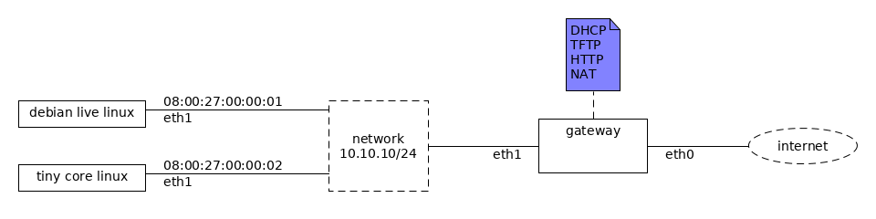

This is a [Vagrant](https://www.vagrantup.com/) Environment for a [Preboot Execution Environment (PXE)](https://en.wikipedia.org/wiki/Preboot_Execution_Environment) gateway.

# Usage

Run `create_empty_box.sh` to create the `empty` environment (the PXE client machines use it as a base box).

Run `vagrant up gateway` to launch the gateway.

Run `vagrant up ubuntu` to launch the `ubuntu` PXE client. Note that
vagrant wont be able to connect to it; the ideia is just to see it PXE boot.

Run `vagrant up tcl` to launch the `tcl` (Tiny Core Linux) PXE client.
