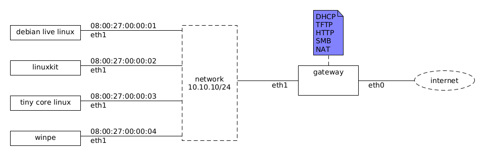

This is a [Vagrant](https://www.vagrantup.com/) Environment for a [Preboot Execution Environment (PXE)](https://en.wikipedia.org/wiki/Preboot_Execution_Environment) gateway.



# Usage

Run `create_empty_box.sh` to create the `empty` environment (the PXE client machines use it as a base box).

Run `vagrant up gateway` to launch the gateway.

Run `vagrant up debian_live` to launch the `debian_live` (Debian Live) PXE client. This assumes you have `../debian-live-builder-vagrant/live-image-amd64.hybrid.iso` built as described at the [rgl/debian-live-builder-vagrant](https://github.com/rgl/debian-live-builder-vagrant) repository.

Run `vagrant up linuxkit` to launch the `linuxkit` (LinuxKit) PXE client. This assumes you have `../linuxkit-vagrant/shared/sshd-kernel` (and `sshd-initrd.img`) built as described at the [rgl/linuxkit-vagrant](https://github.com/rgl/linuxkit-vagrant) repository.

Run `vagrant up tcl` to launch the `tcl` (Tiny Core Linux) PXE client.

# PXE boot

This is roughly how Debian Live Linux is booted on a PXE PC:

1. The PC broadcasts an DHCP request
2. The DHCP server returns the TFTP address of the bootloader (`lpxelinux.0`)
3. The PC TFTP downloads the `lpxelinux.0` file
4. `lpxelinux.0` HTTP downloads `ldlinux.c32` with a request similar to:
    ```plain
    GET /debian-live/ldlinux.c32 HTTP/1.0
    Host: 10.10.10.2
    User-Agent: Syslinux/6.03
    Connection: close
    Cookie: _Syslinux_ip=10.10.10.100%3A10.10.10.2%3A10.10.10.2%3A255.255.255.0
    Cookie: _Syslinux_BOOTIF=01-08-00-27-00-00-03
    Cookie: _Syslinux_SYSUUID=00000000-0000-4000-8000-000000000003
    Cookie: _Syslinux_CPU=6PXL
    Cookie: _Syslinux_SYSVENDOR=innotek+GmbH
    Cookie: _Syslinux_SYSPRODUCT=VirtualBox
    Cookie: _Syslinux_SYSVERSION=1.2
    Cookie: _Syslinux_SYSSERIAL=0
    Cookie: _Syslinux_SYSFAMILY=Virtual+Machine
    Cookie: _Syslinux_MBVENDOR=Oracle+Corporation
    Cookie: _Syslinux_MBPRODUCT=VirtualBox
    Cookie: _Syslinux_MBVERSION=1.2
    Cookie: _Syslinux_MBSERIAL=0
    Cookie: _Syslinux_BIOSVENDOR=innotek+GmbH
    Cookie: _Syslinux_BIOSVERSION=VirtualBox
    Cookie: _Syslinux_SYSFF=1
    ```
5. `lpxelinux.0` HTTP downloads the configuration from one the first addresses that return an HTTP 200:
    ```plain
    /debian-live/pxelinux.cfg/00000000-0000-4000-8000-000000000003
    /debian-live/pxelinux.cfg/01-08-00-27-00-00-03
    /debian-live/pxelinux.cfg/0A0A0A64
    /debian-live/pxelinux.cfg/0A0A0A6
    /debian-live/pxelinux.cfg/0A0A0A
    /debian-live/pxelinux.cfg/0A0A0
    /debian-live/pxelinux.cfg/0A0A
    /debian-live/pxelinux.cfg/0A0
    /debian-live/pxelinux.cfg/0A
    /debian-live/pxelinux.cfg/0
    /debian-live/pxelinux.cfg/default
    ```
6. `lpxelinux.0` HTTP downloads and loads `linux` and `initrd` into memory
7. `lpxelinux.0` transfers control to `linux`
8. `initrd` HTTP downloads and mounts the root filesystem (`filesystem.squashfs`)

You can see all of this if you run the following command on your linux host before launching the `debian_live` vm:

```bash
wireshark -k -i <(ssh -i .vagrant/machines/gateway/virtualbox/private_key vagrant@10.10.10.2 'sudo tcpdump -s 0 -U -n -i eth1 -w - not tcp port 22')
```
